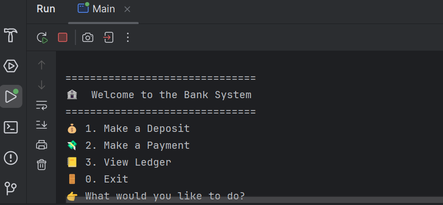
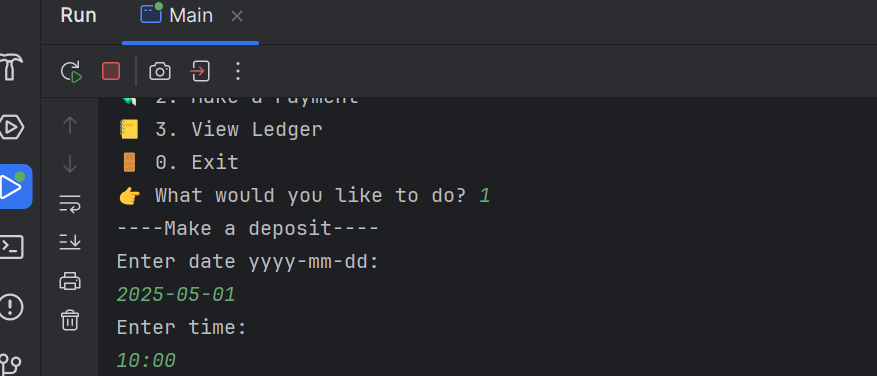
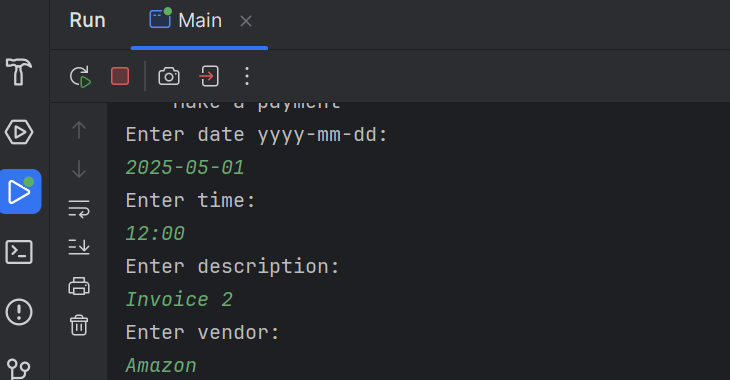
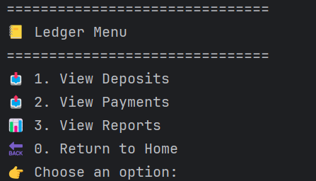
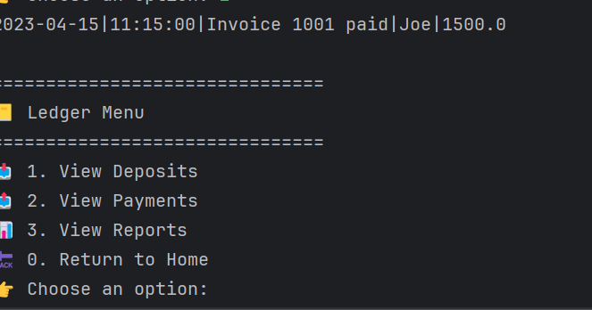
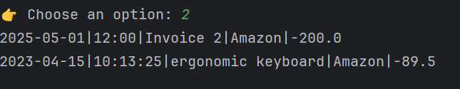
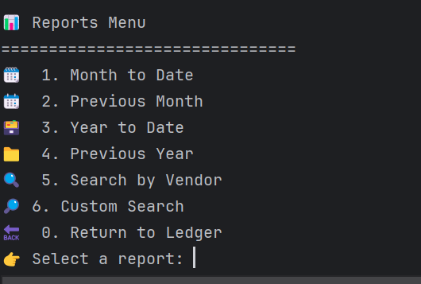
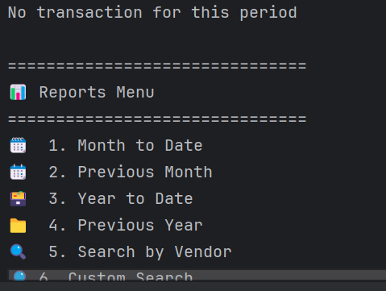
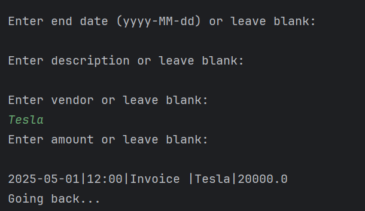

# Accounting Ledger Application 

In this project we created a Ledger App which has various uses. 

First off, we're going to be welcomed into the banking system. In here we have the option to Make a deposit, payment, 
view ledger or to exit the program. 

In here you can make a deposit. Within the deposit you're able to put in the date, time, description, vendor, and 
the amount. 

In the payment menu it's similar to the deposit menu only this time you're going to make payments and when you go to 
ledger you'll see a negative number meaning the payment has been successful. 

After user clicks on the 3rd option you will be transferred to the ledger menu. In here you'll have
the option to view deposits, payment, reports, or return to home.

The user will be able to see all of their previous deposits. From the most recent to the oldest.

The user will be able to see all of their previous payments. From the most recent to the oldest.

In here you'll see a multitude amount of options. Ranging from seeing payments you made this month to custom search.

In previous month you'll see all transactions you did within the previous month but when you didn't made any 
transactions for the past month you'll get a message.

In custom search you'll be able to see any transactions you made. If in case you don't remember 
the day you made a purchase but remember the vendor you can leave everything blank except for the vendor
so you'll see all the transactions made with that vendor.

